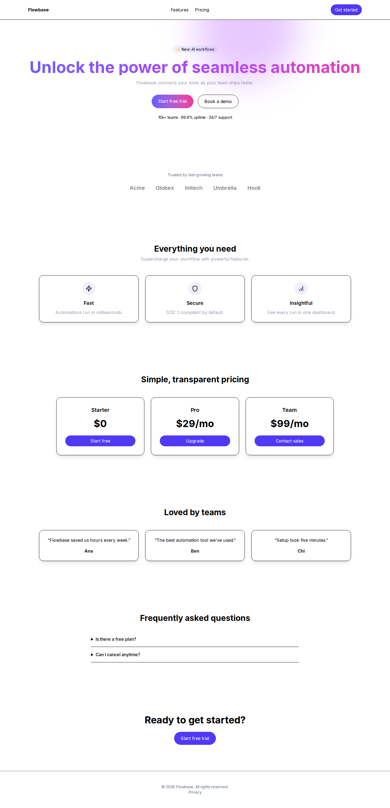
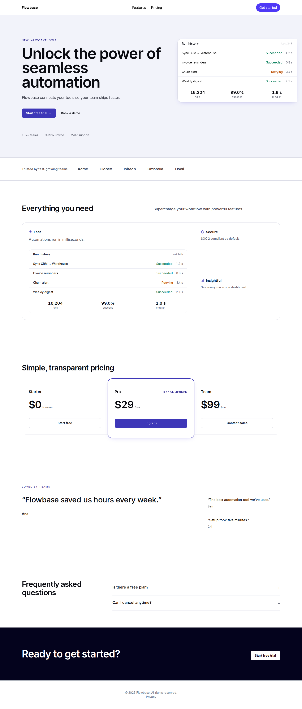
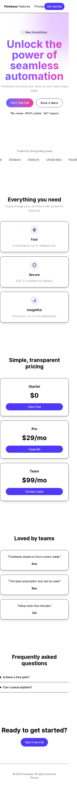
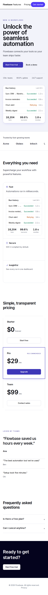

# 1. Những gì đã nâng cấp

Tài liệu này tổng hợp mọi thay đổi của plugin **ui-ux-design** (repo `doantuan22/Onni_UIUX_Design`) từ bản phát
hành đầu tiên đến đợt nâng cấp giao diện 4 bước. Mỗi mục ghi rõ: vấn đề, giải pháp, công cụ/tệp liên quan và bằng
chứng kiểm chứng.

## 1.1. Dòng thời gian

| Mốc | PR | Nội dung chính |
|---|---|---|
| **v0.1.0** — phát hành đầu tiên | #1 | Sửa các lỗi chặn phân phối (CI đa hệ điều hành, đóng gói, cài trực tiếp từ GitHub cho Claude Code/Codex), chọn giấy phép Apache-2.0, đổi tên repo, sửa 125 link Markdown hỏng và thêm test chặn link hỏng |
| Ổn định CI | #2 | Nâng thời gian chờ subprocess trên Windows từ 30 s lên 120 s |
| README mới | #3 | Viết lại README thành trang giới thiệu sản phẩm |
| **v0.1.1** — sửa MCP | #4 | MCP server khởi chạy bằng `${UIUX_PYTHON:-python3}`: máy Windows không có `python3` chỉ cần `setx UIUX_PYTHON python` |
| Nâng cấp UI — bước 1–3 | #5 | Mức ambition (Refine/Elevate/Reimagine), bản đồ cấu trúc UI, 18 code recipe React + Tailwind / Next.js |
| Nâng cấp UI — bước 4 | #6 | Vòng review bằng ảnh chụp với agent phản biện độc lập và chấm điểm có gate đo lường |

Tổng số tool công khai (MCP/CLI): **24 → 28** (`map_ui_structure`, `diff_ui_maps`, `suggest_recipes`,
`score_visual_critique`).

## 1.2. Vấn đề mà đợt nâng cấp giao diện giải quyết

Khi thử plugin, yêu cầu "nâng cấp giao diện / làm đẹp" cho một frontend có sẵn cho ra thay đổi **rất ít**. Nguyên nhân
nằm ở 4 chỗ:

1. **Chính sách quá bảo thủ:** mọi yêu cầu mơ hồ ("modernize", "làm đẹp") bị xếp vào L1 — chỉ được sửa khoảng cách,
   trạng thái, a11y. Bố cục bị khoá hoàn toàn.
2. **Không hiểu cấu trúc frontend:** công cụ phân tích chỉ nhận diện framework, màu, font ở mức thô; không biết trang
   gồm những section nào, section nào là hero, pricing hay FAQ, nội dung là gì.
3. **Kiến thức chỉ là mô tả:** kho knowledge có 248 mục YAML (tên pattern, khi nào dùng) nhưng **không có code** để
   hiện thực hoá.
4. **Không có vòng kiểm chứng bằng hình ảnh:** không ai nhìn kết quả thật; "xong" nghĩa là code biên dịch được.

## 1.3. Bước 1 — Mức ambition (Refine / Elevate / Reimagine)

**Giải pháp:** tách "được phép chạm vào đâu" (change budget L1/L2/L3, giữ nguyên) khỏi "phải thay đổi bao xa" (ambition).

| Ambition | Khi nào | Được thay đổi | Giữ nguyên |
|---|---|---|---|
| Refine | "giữ nguyên bố cục", "chỉ tinh chỉnh", sửa 1 component, a11y/responsive | Khoảng cách, trạng thái, tương phản | Mọi thứ nhìn thấy |
| **Elevate** (mặc định cho nâng cấp) | "nâng cấp", "làm đẹp", "modernize", "premium" | Bố cục section, phân cấp, cỡ chữ, bề mặt, hiệu ứng | Khung app, điều hướng, route, nội dung, dữ liệu, màu gốc thương hiệu, logo |
| Reimagine | "redesign toàn bộ", dự án mới | Những gì được cho phép rõ ràng | Phần còn lại |

- `orchestrate_ui` trả thêm `ambition`, `protected_properties.page_composition`, `allow_motion_library`.
- Cụm từ bảo thủ luôn thắng ("nâng cấp nhưng giữ nguyên bố cục" → Refine). Yêu cầu mơ hồ **vẫn không** mở L3.
- Bộ phân loại thay đổi và bộ gác preservation chấp nhận việc bố cục lại section khi có design direction; quy tắc mới
  `CONTENT_PRESERVATION` đánh trượt mọi thay đổi làm mất nội dung/nút hành động.
- **Framer Motion (Motion) / GSAP:** ở Elevate/Reimagine được đề xuất **một** thư viện khi CSS không đủ; plugin không
  tự cài mà đưa lệnh cài cho người dùng.
- Tài liệu mới: `workflows/ambition-levels.md` (quy trình Elevate 6 bước), `skills/design-direction/signature-moves.md`
  (25 "dấu ấn riêng" kèm gợi ý Tailwind), `knowledge/visual-language/anti-slop/default-banlist.md` (17 mẫu "giao diện
  kiểu AI" kèm dấu hiệu code và cách thay thế).

## 1.4. Bước 2 — Bản đồ cấu trúc frontend

**Giải pháp:** bộ đọc JSX/TSX và template (Vue, Svelte, Astro, HTML) viết bằng Python thuần, không phụ thuộc ngoài.

- **`map_ui_structure`** trả về:
  - route và **khung app** quanh vùng trang (layout Next.js App/Pages Router, React Router, Vue Router, HTML);
  - các **section theo thứ tự** trên từng trang, mỗi section có vai trò (hero, features, pricing, testimonials, FAQ,
    CTA, bảng dữ liệu, form…), **danh sách nội dung** (heading, nút/link, ảnh, ô nhập, dữ liệu gắn), kiểu bố cục hiện tại
    và chữ ký bố cục, tín hiệu chuyển động;
  - **17 loại dấu hiệu "giao diện AI"** và mức độ chung chung (thấp/vừa/cao) cho từng route;
  - component đang dùng và **token thực tế** (tông màu chủ đạo, font, bo góc, đổ bóng).
- Hiểu nội dung truyền qua props, hằng số module và `.map` trên mảng literal → danh sách nội dung là chữ thật ("Starter",
  "Upgrade"), không phải `{p.name}`.
- **`diff_ui_maps`** so bản đồ trước/sau: nội dung bị mất, section đã bố cục lại, dấu hiệu AI đã hết/mới xuất hiện, và
  có đạt "chuẩn Elevate" (giữ đủ nội dung + ít nhất một nửa section được bố cục lại) hay không.

## 1.5. Bước 3 — Thư viện code recipe (React + Tailwind, Next.js)

18 recipe **type-check với `tsc --strict`** (React 19, Next.js 15, Motion 12, GSAP 3) và render thật trong Next.js 15 +
Tailwind 4, nằm ở `knowledge/code-recipes/`:

| Nhóm | Recipe |
|---|---|
| Token | Theme Tailwind v4 suy ra từ màu gốc thương hiệu (dải màu, ink, bo góc, đổ bóng theo vai trò, easing) |
| Section (11) | Hero chia đôi bất đối xứng, bento features, editorial index, sticky narrative, pricing có gói nổi bật, testimonial spotlight, logo marquee, FAQ hai cột, CTA band tràn viền, stats strip, dashboard focus |
| Motion (5) | Hero entrance (Motion), scroll product reveal (Motion hoặc CSS), shared-layout cards (Motion), pinned steps (GSAP), tactile button (CSS) |
| Surface (1) | Texture grain / dot-grid |

- Nội dung đi qua props → giữ nguyên chữ, nút và dữ liệu cũ. Mọi recipe có nhánh cho chế độ giảm chuyển động.
- **`suggest_recipes`** chọn recipe cho từng section theo vai trò và theo dấu hiệu AI mà recipe thay thế; với recipe
  chuyển động báo `available` / `needs_install` (kèm lệnh cài) / `css_fallback`.
- Fixture minh hoạ: `development/fixtures/targets/target-c-next-tailwind` (trang "kiểu AI" điển hình) và bản
  `…-elevated` dựng lại bằng recipe.

| Trước (desktop) | Sau (desktop) |
|---|---|
|  |  |

| Trước (mobile) | Sau (mobile) |
|---|---|
|  |  |

## 1.6. Bước 4 — Vòng review bằng ảnh chụp

- **`review/visual-critique.md`:** chụp trước/sau bằng `run_runtime` (mobile, tablet, desktop + một bản giảm chuyển
  động) → `diff_ui_maps` + `accessibility_scan` → **agent phản biện độc lập** chấm điểm → `score_visual_critique` →
  lặp tối đa 2 lần theo `next_focus` → ghi vào `VISUAL-CRITIQUE.md`.
- **Rubric 8 tiêu chí có trọng số:** phân cấp (0.18), bố cục (0.16), typography (0.14), màu/bề mặt (0.12), độ riêng biệt
  (0.14), độ chỉn chu (0.12), responsive (0.08), chuyển động (0.06).
- **`agents/visual-critic.md`:** subagent Claude Code chỉ có quyền đọc (Read, Glob, Grep), chấm ảnh theo rubric, trả
  JSON; không được đọc code hay ghi chú của người sửa. Host không có subagent (Codex) chạy phần critique trong ngữ cảnh mới.
- **`score_visual_critique`:** kiểm tra JSON của critic, tính điểm, áp **9 gate đo lường** độc lập với critic (giữ nội
  dung, tràn ngang, axe, chuẩn Elevate, dấu hiệu AI mới, giảm chuyển động, vùng chạm nhỏ, chữ nhỏ, màn hình đầu) và trả
  `pass` / `iterate` (kèm việc cần sửa) / `stop`.
- **Probe bố cục mới trong `run_runtime`** (`options.layout_probe`): tràn ngang và phần tử gây tràn, chữ < 12 px, vùng
  chạm < 24 px, cấp heading, h1 và nút chính có nằm trong màn hình đầu, ảnh thiếu `alt`. Manifest axe ghi thêm mức độ lỗi.

**Kết quả chạy thật trên fixture demo:**

| | Trang gốc | Bản dựng lại bằng recipe |
|---|---|---|
| Tràn ngang mobile | 54 px (dòng logo) | 0 px |
| axe | 10 lỗi tương phản mức *serious* | 0 lỗi |
| Điểm rubric | 2.13 → `iterate` (bị gate chặn) | 4.0 → `pass`, 9/9 gate đạt |

Vòng review đã bắt được 3 lỗi mà test tĩnh bỏ sót: hero mờ vĩnh viễn khi chế độ giảm chuyển động bật sau khi tải,
section bị co hẹp trong khung `flex flex-col`, nhãn "Recommended" chỉ 11.2 px.

## 1.7. Quy trình hoàn chỉnh khi người dùng yêu cầu "nâng cấp giao diện"

```
orchestrate_ui          → ambition = elevate, allow_motion_library = true
map_ui_structure        → .uiux/ui-map.json + bảng section (CURRENT-UX-MAP.md)
run_runtime (before)    → ảnh chụp + layout/motion probe
DESIGN-DIRECTION.md     → thesis, ≥ 3 signature moves, chẩn đoán theo banlist, kế hoạch bố cục lại
suggest_recipes         → recipe cho từng section, token trước
(triển khai)            → token → section → chuyển động
map_ui_structure + diff_ui_maps, run_runtime (after), accessibility_scan
visual-critic           → JSON chấm điểm trước/sau
score_visual_critique   → pass | iterate (tối đa 2 lần) | stop (báo vấn đề còn mở)
```

## 1.8. Kiểm chứng

- 612 test Python chạy trên Python 3.9–3.13 × Ubuntu/Windows/macOS (CI), cộng `validate_skill`, kiểm tra knowledge,
  80 kịch bản eval, `self_test`, build + verify gói (V1–V14) và `claude plugin validate`.
- Ngoài bộ test (cần npm): recipe qua `tsc --strict`; hai app fixture build bằng Next.js 15 + Tailwind 4; chụp bằng
  Playwright 1.56 và quét axe.
