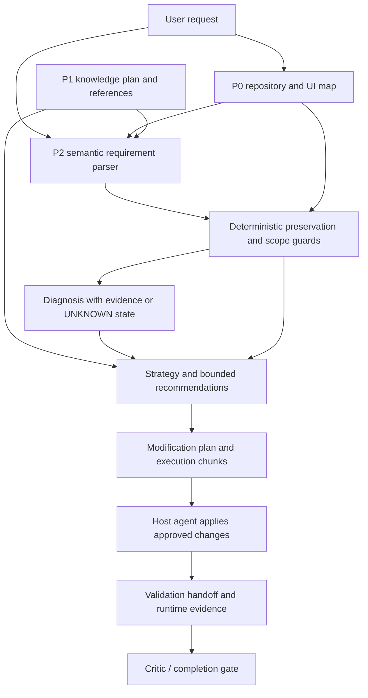

# Reasoning Data Flow

The `SemanticRequirement` is an internal structured interpretation. Its evidence references point to the request or supplied project/knowledge records; they do not embed large source files. The plan exposes a short rationale and does not persist chain-of-thought. The active parser mode is `HEURISTIC_FALLBACK`; there is no provider call in core.

The deterministic preservation guard remains authoritative for L1/L2/L3, protected properties, and granular redesign/palette/layout authorization. An unknown target is not promoted to a project-wide target. The planning stage returns chunks for the host agent; the smoke harness did not apply those chunks or claim that it did.

Real local traces are stored in `development/benchmark-runs/tier3-plugin-pipeline-smoke.json`. They stop at runtime verification because browser capability is undeclared.
